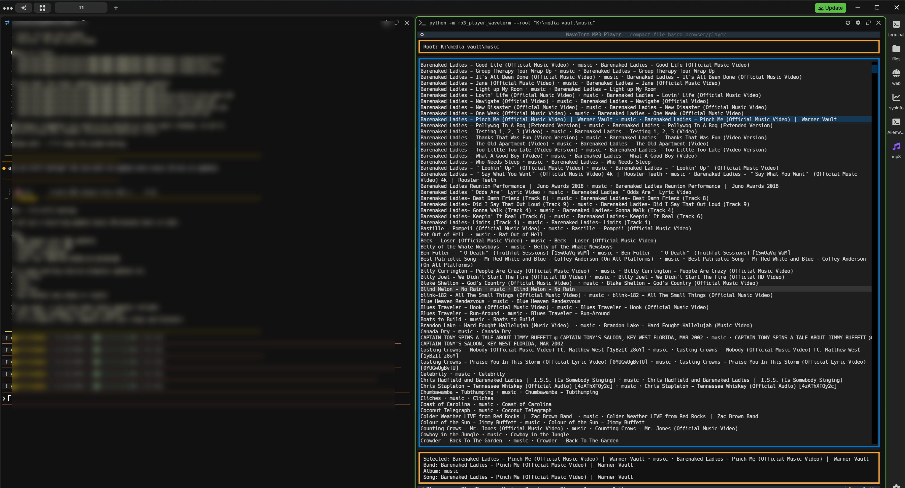
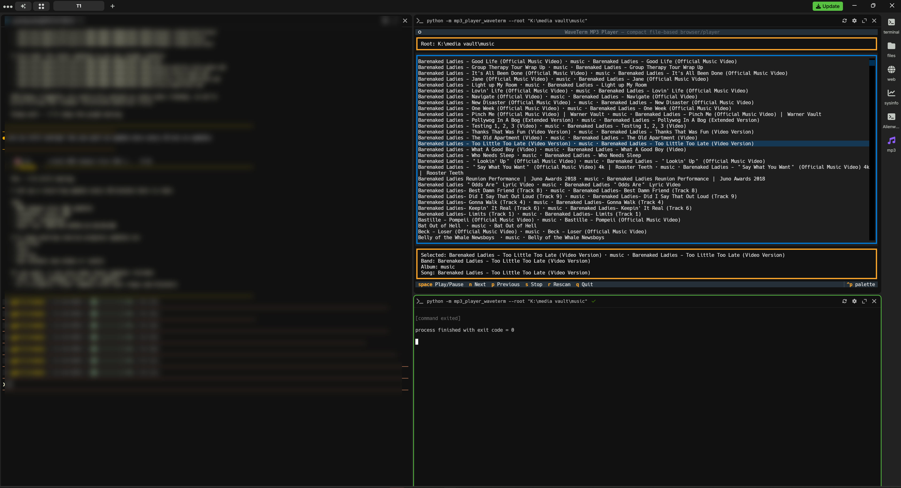

A small, practical MP3 browser/player for WaveTerm and tight terminal panes.

Use it when you want a fast music browser in a quarterpanel or narrow split without a lot of extra UI.

## Screenshots

Main view:



Quarterpanel view:



## What it does

- browses a folder tree of `.mp3` files
- shows short metadata like `band · album · song`
- keeps the now-playing status pinned at the top
- supports keyboard control:
  - Enter = play selected
  - Space = play selected, or pause/resume when already playing
  - n / p = next / previous
  - s = stop
  - r = rescan
  - q = quit
- automatically advances to the next song when a track ends
- uses a fast startup scan by default so large libraries load quicker
- can optionally show a simple terminal visualizer

## Install

From the repo root:

```powershell
python -m pip install -e .
```

If you want in-app playback, install the Python VLC binding too:

```powershell
python -m pip install python-vlc
```

You also need the VLC desktop app installed on Windows so Python can find `libvlc`.

## Quick test in PowerShell

Run these from a PowerShell prompt:

```powershell
cd K:\agents\hermes\mp3
waveterm-mp3-doctor
python -m mp3_player_waveterm --root "K:\media vault\music"
```

If you want richer metadata and don’t mind a slower first load:

```powershell
python -m mp3_player_waveterm --full-scan --root "K:\media vault\music"
```

If you want the simple visualizer:

```powershell
python -m mp3_player_waveterm --visuals --root "K:\media vault\music"
```

You can also pick a visual style explicitly:

```powershell
python -m mp3_player_waveterm --visuals --visual-mode pulse --root "K:\media vault\music"
python -m mp3_player_waveterm --visuals --visual-mode bars --root "K:\media vault\music"
python -m mp3_player_waveterm --visuals --visual-mode wave --root "K:\media vault\music"
python -m mp3_player_waveterm --visuals --visual-mode minimal --root "K:\media vault\music"
python -m mp3_player_waveterm --visuals --visual-mode auto --root "K:\media vault\music"
```

## WaveTerm widget snippets

If you want this as a clickable WaveTerm widget, see `WIDGETS.md` or copy `widgets.example.json` into your WaveTerm config.

### Windows-safe widget

Use this when you’re on the Windows box and want the player pointed at the NAS music folder:

```json
"waveterm-mp3": {
  "display:order": 10,
  "icon": "music",
  "label": "mp3",
  "color": "#8b5cf6",
  "description": "WaveTerm MP3 player",
  "blockdef": {
    "meta": {
      "view": "term",
      "controller": "cmd",
      "cmd": "python -m mp3_player_waveterm --root \"K:\\media vault\\music\"",
      "cmd:shell": true,
      "cmd:cwd": "K:\\agents\\hermes\\mp3",
      "cmd:runonstart": true,
      "cmd:clearonstart": true,
      "cmd:closeonexit": false,
      "cmd:nowsh": false
    }
  }
}
```

### Mac/Linux widget

Use this version on macOS or Linux. It assumes your music lives in `~/Music` and uses `python3`:

```json
"waveterm-mp3": {
  "display:order": 10,
  "icon": "music",
  "label": "mp3",
  "color": "#8b5cf6",
  "description": "WaveTerm MP3 player",
  "blockdef": {
    "meta": {
      "view": "term",
      "controller": "cmd",
      "cmd": "python3 -m mp3_player_waveterm --root \"$HOME/Music\"",
      "cmd:shell": true,
      "cmd:runonstart": true,
      "cmd:clearonstart": true,
      "cmd:closeonexit": false,
      "cmd:nowsh": false
    }
  }
}
```

### Visuals-on-start widget

If you want the simple visualizer enabled every time the widget opens, use this command instead:

```json
"waveterm-mp3-visuals": {
  "display:order": 11,
  "icon": "music",
  "label": "mp3+v",
  "color": "#22c55e",
  "description": "WaveTerm MP3 player with visuals",
  "blockdef": {
    "meta": {
      "view": "term",
      "controller": "cmd",
      "cmd": "python -m mp3_player_waveterm --visuals --root \"K:\\media vault\\music\"",
      "cmd:shell": true,
      "cmd:cwd": "K:\\agents\\hermes\\mp3",
      "cmd:runonstart": true,
      "cmd:clearonstart": true,
      "cmd:closeonexit": false,
      "cmd:nowsh": false
    }
  }
}
```

## WaveTerm setup

This is the setup I’d use inside WaveTerm:

1. Open WaveTerm.
2. Open a PowerShell tab or pane.
3. Clone or pull this repo.
4. Go to the repo root:
   ```powershell
   cd K:\agents\hermes\mp3
   ```
5. Install the package:
   ```powershell
   python -m pip install -e .
   ```
6. Check the audio backend:
   ```powershell
   waveterm-mp3-doctor
   ```
7. Start the player:
   ```powershell
   python -m mp3_player_waveterm --root "K:\media vault\music"
   ```

Best results are in a narrow WaveTerm pane or a 1/4-width split.

## Audio notes

- If the app says `audio backend: null`, VLC/libVLC is not loading in that environment.
- The app will still run and browse music even without audio.
- When VLC is available, playback should happen in-process instead of launching Windows Media Player.

## Performance notes

- Startup uses a fast scan by default: file names only, no tag parsing.
- The library scan runs in the background so the UI appears faster on big folders.
- `--full-scan` reads tags with Mutagen and will take longer on large libraries.
- A small local cache is used to speed up repeat launches.
- The track list is the file tree itself, not M3U files.
- Metadata falls back cleanly if tags are missing.

## Roadmap

See `PLAN.md` for the current working plan.

## Credits

Built by Shane Robinett / Shane @ Veanox.com.

## Files

- `pyproject.toml` - Python package metadata and entry points
- `WIDGETS.md` - widget setup guide and copy/paste snippets
- `widgets.example.json` - ready-made WaveTerm widget examples
- `src/mp3_player_waveterm/__main__.py` - module entry point
- `src/mp3_player_waveterm/app.py` - Textual UI
- `src/mp3_player_waveterm/library.py` - library scanning and metadata helpers
- `src/mp3_player_waveterm/player.py` - VLC probing and playback backend
